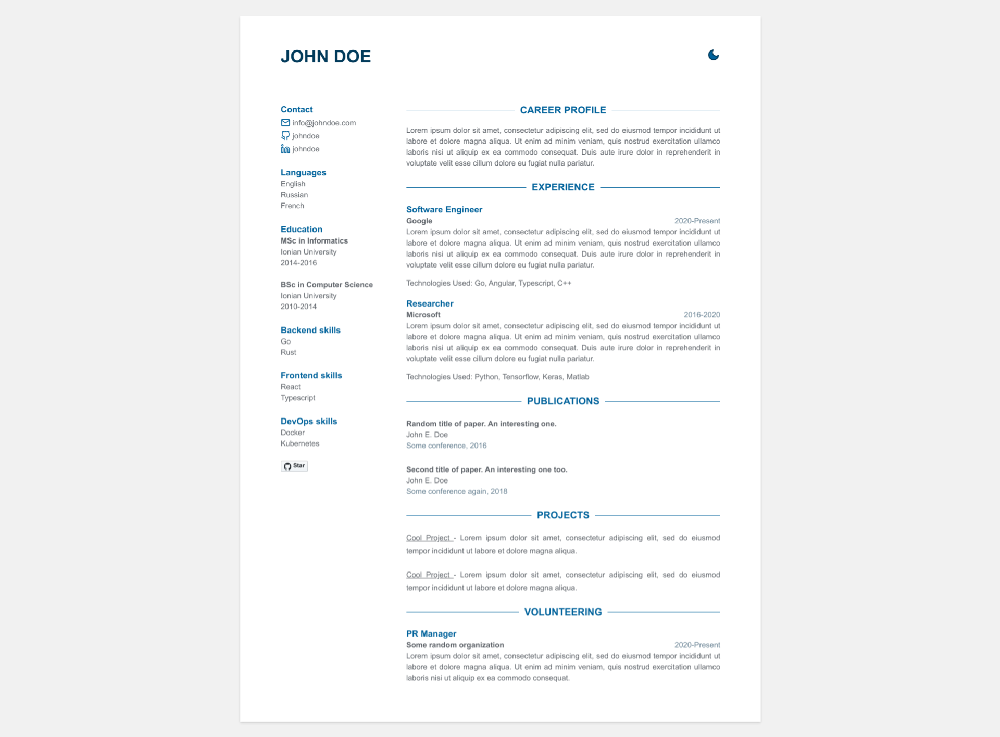

# CV jekyll theme

Free theme for the creation of your CV. View demo [here](https://jekyll-cv.stavrospanakakis.com/).

## Features
- Lightweight
- Free & Open Source
- Mobile Responsive
- Dark Mode Support


## Preview


## Installation
- [Fork](https://github.com/stavrospanakakis/jekyll-cv/fork) the repository
- Create a ```gh-pages``` branch
- Go to Settings and select ```gh-pages``` as Github Pages source
- Replace dummy data at ```_data/data.yml``` and ```_config.yml```
- You're done!

Go to https://username.github.io/jekyll-cv/

## Contributing 
- Feel free to open issues and create pull requests for new features or skins

## License
- [MIT](./LICENSE)
